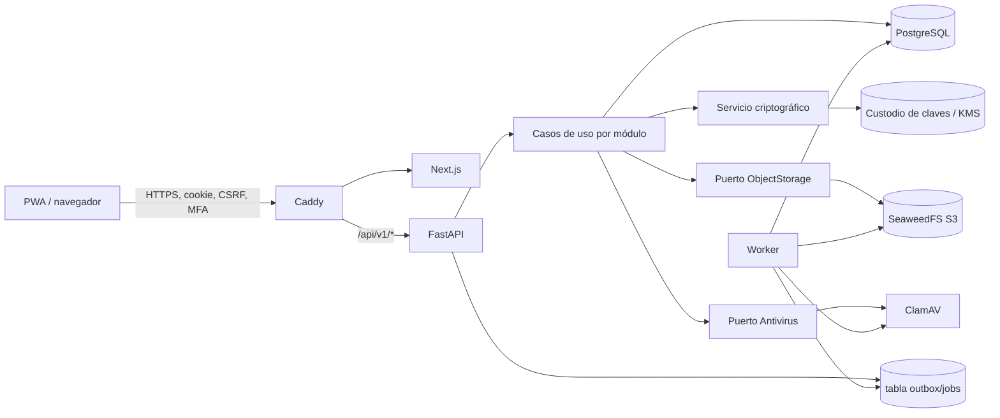
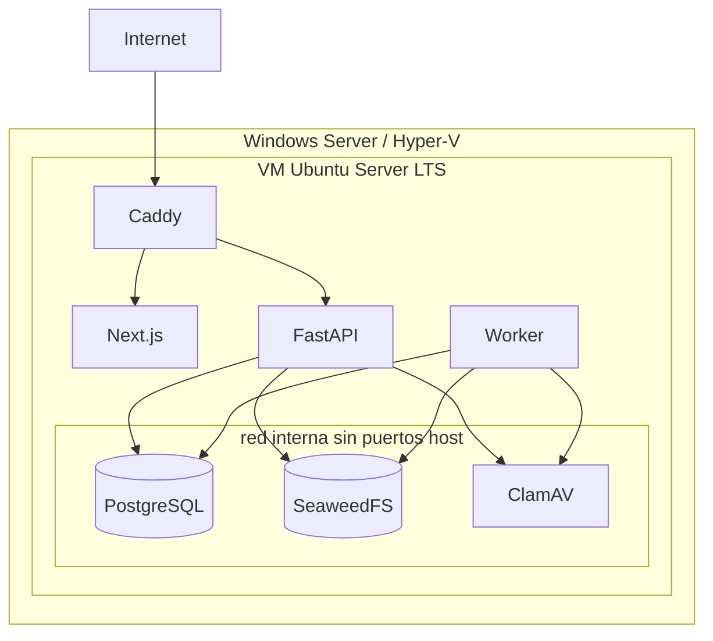
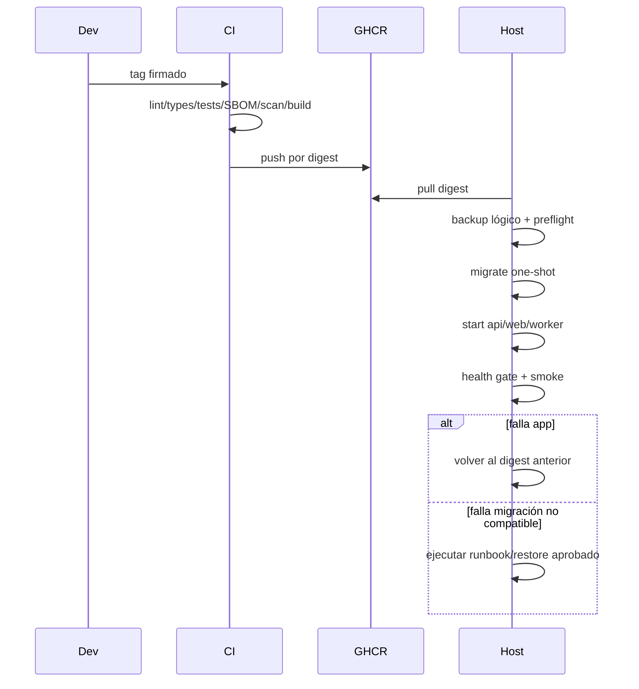

# Arquitectura lógica y despliegue V1

**Estado arquitectónico:** aprobado por la persona solicitante el 2026-09-02 con
la opción A (servidor/VM compatible). El host concreto y la evidencia de sus gates
siguen pendientes. Monolito modular desplegado como procesos separados, con
contratos internos explícitos.

## 1. Vista lógica



Next.js no es autoridad de autorización ni accede a PostgreSQL. FastAPI aplica
tenant/scope/guards y coordina transacciones. El worker usa el mismo paquete de
dominio para antivirus, reportes y tareas; V1 evita sumar broker hasta que la
carga lo justifique, usando jobs persistidos con `FOR UPDATE SKIP LOCKED`.

## 2. Trust boundaries y flujos sensibles

| Frontera | Datos | Controles |
|---|---|---|
| Internet → Caddy | credenciales, cookies, uploads | TLS, límites, rate limit, headers, body size, logs sin payload |
| Browser → API | comandos y PII visible | cookie HttpOnly/Secure/SameSite, CSRF, MFA reciente, schema estricto |
| PWA offline | dataset enmascarado, fotos, mutations | AES-GCM, contraseña local, TTL 7 días, purge y revocación |
| API → PostgreSQL | dominio, envelopes de PII y tokens HMAC | rol mínimo, red privada, TLS si cruza host, constraints/RLS, backup cifrado; HMAC no se expone |
| API/worker → custodio de claves | unwrap de DEK y HMAC de lookup | identidad de servicio, claves de cifrado y HMAC separadas, versiones/rotación, acceso auditado; material fuera de DB/repositorio |
| API/worker → S3 | archivos privados | object keys opacas, hash, server-side policy, sin bucket público |
| cuarentena → disponible | archivo no confiable | MIME real, tamaño, hash, ClamAV, fail closed, buckets/prefix separados |
| worker → PDF | snapshot y plantilla | template DSL allowlist, proceso acotado, hash y versión |
| CI → GHCR/host | imágenes y release | permisos mínimos, OIDC/secretos protegidos, tags/digests, tag firmado |

## 3. Despliegue



La opción A aprobada conserva el baseline objetivo en un servidor distinto de la
estación de trabajo actual: VM 8 vCPU, 24 GB RAM y 1 TB cifrado. Sólo Caddy publica 80
para redirect/ACME y 443; DB/S3/AV permanecen internas. Backups salen del host.
Docker Desktop en Windows Server no forma parte de la solución.

El servicio criptográfico implementa contratos distintos: cifrado autenticado
reversible para valores recuperables, HMAC keyed para comparación exacta
pseudonimizada, Argon2id para contraseñas y SHA-256 para integridad. Ni RLS ni la
trazabilidad se delegan a esas primitivas; se aplican antes y después de cada
operación sensible. La tecnología/custodio concreto continúa siendo un pendiente
operativo de `DEC-004` y no se simula con una clave embebida.

## 4. Servicios Compose

| Servicio | Responsabilidad | Health/dependencia |
|---|---|---|
| `caddy` | TLS, routing, headers, límites | HTTPS de `/api/v1/health/live` y web |
| `web` | UI SSR/PWA | HTTP `/healthz`; espera API ready para smoke, no para servir shell |
| `api` | REST/OpenAPI y dominio | live proceso; ready DB + esquema compatible; no depende de S3/AV para live |
| `worker` | reportes, antivirus, jobs | heartbeat en DB y métrica de cola |
| `migrate` | `alembic upgrade head`, one-shot | DB healthy; debe terminar 0 antes de API/worker |
| `db` | PostgreSQL | `pg_isready`; sin puerto publicado |
| `seaweed-master/volume/filer` | S3 privado | endpoints internos y volumen persistente |
| `clamav` | escaneo | daemon healthy; uploads quedan en cuarentena si no está ready |

Imágenes con digest o versión exacta, usuario no root, filesystem read-only cuando
sea posible, `no-new-privileges`, límites y volúmenes explícitos. Desarrollo puede
usar override con bind mounts/reload; producción nunca.

## 5. Estructura del repositorio

```text
apps/
  api/
    migrations/             Alembic y revisiones
    src/hys_api/
      api/v1/               routers y schemas HTTP
      core/                 config, seguridad, errores, telemetría
      db/                   session/UoW y metadata
      modules/<context>/    domain, application, infrastructure
    tests/{unit,integration,contract}/
    pyproject.toml
    uv.lock
  web/
    app/                    rutas App Router
    src/{components,features,lib,offline}/
    tests/{unit,component,e2e}/
    package.json
    package-lock.json
docs/{blueprint,architecture,adr,security,operations}/
infra/{caddy,compose,vm}/
scripts/
.github/workflows/
compose.yaml
```

No se copia el prototipo histórico. Se reexpresan únicamente su jerarquía visual,
paleta y agrupaciones sin datos/copy/lógica heredados.

## 6. Baseline de runtimes y dependencias

Al implementar Hito 1 se congelan locks y digests. Referencia consultada en los
registros oficiales el 2026-09-02:

- Node.js 24 LTS; Next.js 16.3.4, React 19.2.8 y TypeScript 6.0.3. Se
  descartó TypeScript 7.0.2 porque el lint oficial de Next.js aún no lo soporta.
- Python 3.14; FastAPI 0.141.1, SQLAlchemy 2.0.52, Alembic 1.19.1,
  asyncpg 0.31.0 y Pydantic Settings 2.15.0.
- PostgreSQL con major soportada y tag de parche/digest fijado al crear el lock de
  infraestructura.

Las versiones son punto de resolución, no permiso para usar `latest`. CI valida
compatibilidad y vulnerabilidades antes de aceptar el lock.

## 7. Release, migración y rollback



- Migraciones expand/contract y backward-compatible durante al menos una release.
- Nunca borrar/renombrar columna usada en el mismo despliegue que introduce su
  reemplazo.
- Rollback normal cambia imagen, no hace downgrade destructivo.
- Un tag contiene digests, revisión Alembic requerida y changelog.
- El health gate exige versión de esquema compatible, no sólo conexión DB.

## 8. Decisiones de capacidad

No se promete que 200 GB entren sólo por suma de volúmenes: se reservan cuotas
para DB, objetos, cuarentena, reportes, logs y snapshots. Alertas a 70/80/90 % y
rechazo controlado de nuevas cargas antes de agotar disco. `DEC-001` fijó la
opción A; las cifras finales todavía dependen del inventario del servidor elegido.
