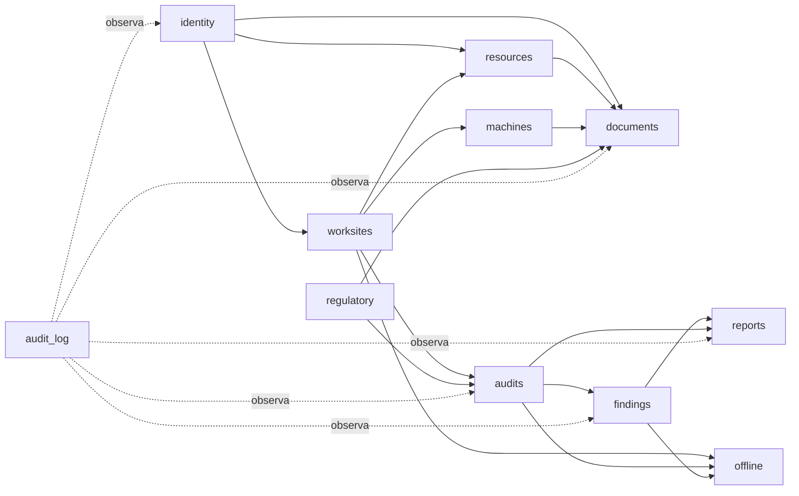

# Monolito modular y ownership de datos

## Context map

Las flechas representan dependencia de contratos públicos del módulo destino,
no acceso directo a sus tablas. No se permiten ciclos entre servicios de dominio;
los efectos cruzados se coordinan desde casos de uso de aplicación y se registran
en la misma transacción cuando corresponda.

## Ownership e invariantes

| Módulo | Es dueño de | Invariantes principales | Publica/expone |
|---|---|---|---|
| `identity` | Organization, User, Role, Permission, UserScope, Session, MFA | MFA obligatorio; mínimo privilegio; una organización activa en V1 | actor, permisos y scopes efectivos |
| `worksites` | Worksite, Jurisdiction de obra, StageCatalog, WorksiteStage | etapas temporales; varias activas; toda obra pertenece a un tenant | obra y etapas vigentes/snapshot |
| `resources` | Contractor, Person, relaciones laborales y asignaciones | personas/contratistas reutilizables; intervalos no contradictorios | sujetos autorizables y asignaciones |
| `documents` | tipos, requisitos documentales, documentos, versiones, assets y links explícitos | una carga crea versión; revisión almacenada; vigencia derivada; archivo privado | estado documental y referencias inmutables |
| `machines` | Machine, asignaciones a obra/operador, inspecciones | estado sólo por transición válida; operador temporal | condición y documentos requeridos |
| `audits` | Audit, Attendance, ControlCatalogVersion, snapshot y AuditControl | editor/dispositivo único; finalizada inmutable; respuestas justificadas | resultados y snapshot firmado lógicamente |
| `findings` | Finding, Evidence, Correction, Verification | no autocierre; plazo y criticidad versionable; historia append-only | estado y evidencia verificable |
| `offline` | paquetes, instalaciones, mutations, batches, conflicts | TTL 7 días; idempotencia; servidor manda en maestros; sin LWW | comandos validados y conflictos revisables |
| `reports` | plantilla versionada, reporte y conformidad | reproducción por snapshot/hash; nunca HTML arbitrario | artefacto completo o redactado |
| `regulatory` | fuentes, jurisdicción normativa, reglas/versiones, aplicabilidad, requirements y evaluaciones | DSL allowlist; doble aprobación; corpus real inactivo | evaluación APLICA/NO_APLICA/INDETERMINADO |
| `audit_log` | eventos sensibles append-only | no update/delete de aplicación; actor, tenant, request y antes/después minimizado | consulta restringida/exportación trazada |

## Reglas de acoplamiento

- Los modelos ORM viven dentro de su módulo; ningún router construye consultas de
  otro módulo.
- Los IDs cruzan límites sólo como UUID y los snapshots guardan los campos
  históricos estrictamente necesarios.
- Los catálogos pueden tener definición de plataforma, pero toda activación y
  personalización operativa pertenece a una organización.
- `Jurisdiction` canónica pertenece a `worksites`; `regulatory` referencia su ID y
  agrega fuentes/versiones. `Requirement` normativo pertenece a `regulatory` y
  `documents` consume una proyección versionada, evitando ownership duplicado.
- Todo comando sensible produce un evento de `audit_log` dentro de la misma
  unidad de trabajo.

