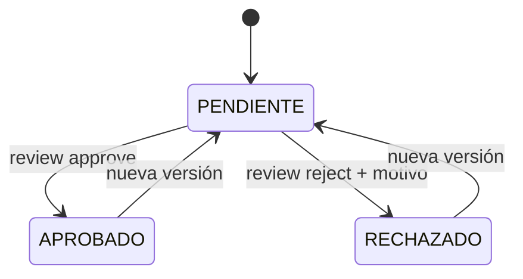
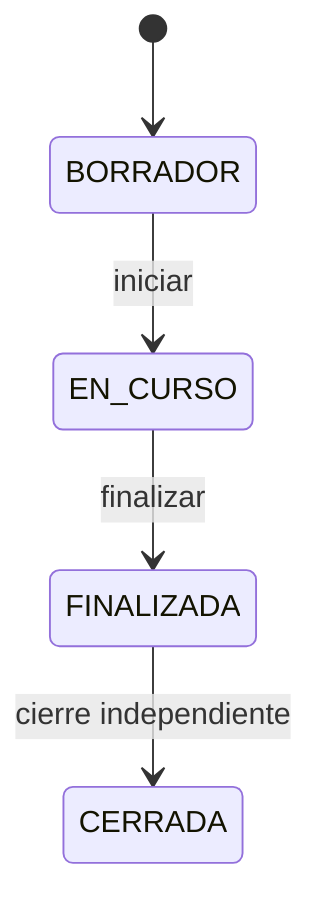
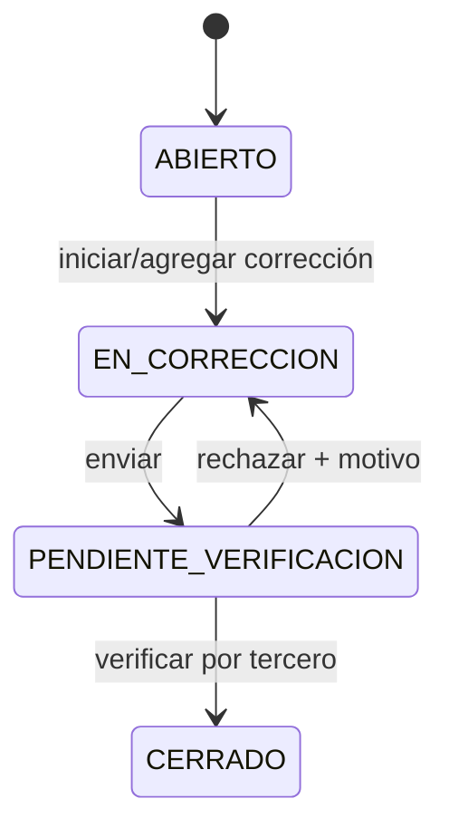
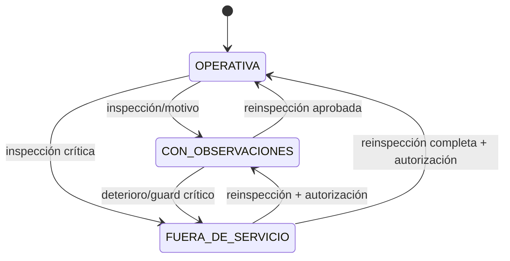
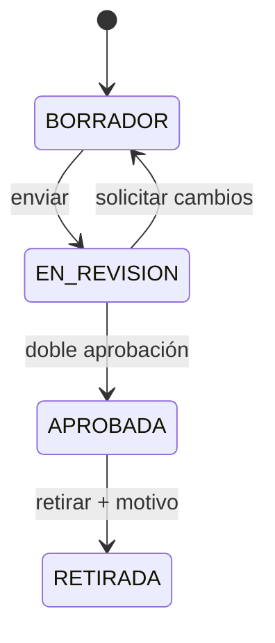

# Modelo de dominio, ERD y estados V1

**Estado arquitectónico:** aprobado como dirección de implementación por la
persona solicitante el 2026-09-02; validaciones nominales y gates técnicos
pendientes. Los nombres son conceptuales; la primera migración debe conservar
estas invariantes aunque use convenciones físicas distintas.

## 1. Convenciones

- PK UUID generada en aplicación; timestamps `timestamptz` en UTC.
- `organization_id NOT NULL` en todo agregado salvo `organizations`.
- `created_at`, `updated_at` y `version` para control optimista; `deleted_at` sólo
  en maestros.
- Intervalos temporales usan `[valid_from, valid_to)`; `valid_to NULL` es abierto.
- Constraints tenant-aware: una FK operativa incluye o verifica
  `organization_id`; ningún UUID basta para cruzar tenant.
- Historia sensible no se actualiza/elimina: se agrega versión, corrección o evento.

## 2. Identidad, obras y recursos

```mermaid
erDiagram
  ORGANIZATION ||--o{ USER : has
  ORGANIZATION ||--o{ ROLE : defines
  ROLE ||--o{ ROLE_PERMISSION : grants
  PERMISSION ||--o{ ROLE_PERMISSION : included
  USER ||--o{ USER_ROLE : receives
  ROLE ||--o{ USER_ROLE : assigned
  USER ||--o{ USER_SCOPE : limited_by
  WORKSITE ||--o{ USER_SCOPE : scopes
  USER ||--o{ SESSION : opens
  USER ||--o{ MFA_FACTOR : owns
  ORGANIZATION ||--o{ WORKSITE : owns
  JURISDICTION ||--o{ WORKSITE : locates
  WORKSITE ||--o{ WORKSITE_STAGE : schedules
  STAGE_CATALOG ||--o{ WORKSITE_STAGE : types
  ORGANIZATION ||--o{ CONTRACTOR : owns
  WORKSITE ||--o{ WORKSITE_CONTRACTOR : assigns
  CONTRACTOR ||--o{ WORKSITE_CONTRACTOR : assigned
  ORGANIZATION ||--o{ PERSON : owns
  PERSON ||--o{ PERSON_IDENTIFIER_LOOKUP : indexed_by
  PERSON ||--o{ PERSON_ASSIGNMENT : participates
  CONTRACTOR ||--o{ PERSON_ASSIGNMENT : employs
  WORKSITE ||--o{ PERSON_ASSIGNMENT : works_at

  ORGANIZATION { uuid id PK; string name; string slug UK; string timezone; timestamp deleted_at }
  USER { uuid id PK; uuid organization_id FK; string email; string password_hash; string status; timestamp deleted_at; int version }
  ROLE { uuid id PK; uuid organization_id FK; string key; string name; bool system; timestamp deleted_at }
  PERMISSION { uuid id PK; string key UK; string description }
  ROLE_PERMISSION { uuid role_id FK; uuid permission_id FK }
  USER_ROLE { uuid user_id FK; uuid role_id FK; timestamp valid_from; timestamp valid_to }
  USER_SCOPE { uuid id PK; uuid organization_id FK; uuid user_id FK; string scope_type; uuid worksite_id FK; timestamp valid_from; timestamp valid_to }
  SESSION { uuid id PK; uuid organization_id FK; uuid user_id FK; bytes token_hash; timestamp expires_at; timestamp revoked_at; uuid device_id }
  MFA_FACTOR { uuid id PK; uuid organization_id FK; uuid user_id FK; string type; bytes secret_ciphertext; timestamp verified_at; timestamp revoked_at }
  JURISDICTION { uuid id PK; string country; string province; string municipality; string code UK }
  WORKSITE { uuid id PK; uuid organization_id FK; uuid jurisdiction_id FK; string code; string name; string status; timestamp deleted_at; int version }
  STAGE_CATALOG { uuid id PK; uuid organization_id FK; string code; string name; int version; timestamp deleted_at }
  WORKSITE_STAGE { uuid id PK; uuid organization_id FK; uuid worksite_id FK; uuid stage_catalog_id FK; timestamp valid_from; timestamp valid_to; string status; int version }
  CONTRACTOR { uuid id PK; uuid organization_id FK; string legal_name; string synthetic_ref; timestamp deleted_at; int version }
  WORKSITE_CONTRACTOR { uuid id PK; uuid organization_id FK; uuid worksite_id FK; uuid contractor_id FK; timestamp valid_from; timestamp valid_to; int version }
  PERSON { uuid id PK; uuid organization_id FK; string display_name; bytes identifier_ciphertext; bytes identifier_nonce; bytes identifier_tag; bytes identifier_wrapped_dek; int identifier_key_version; timestamp deleted_at; int version }
  PERSON_IDENTIFIER_LOOKUP { uuid id PK; uuid organization_id FK; uuid person_id FK; string identifier_kind; int normalization_version; int hmac_key_version; bytes lookup_hmac; timestamp retired_at }
  PERSON_ASSIGNMENT { uuid id PK; uuid organization_id FK; uuid person_id FK; uuid contractor_id FK; uuid worksite_id FK; string relationship_type; timestamp valid_from; timestamp valid_to; int version }
```

Unicidades: `(organization_id,email)`, `(organization_id,role.key)`,
`(organization_id,worksite.code)` y, para cada versión activa de lookup,
`(organization_id,identifier_kind,normalization_version,hmac_key_version,lookup_hmac)`.
La FK de `PERSON_IDENTIFIER_LOOKUP` incluye `organization_id`; RLS cubre tanto el
registro cifrado como sus tokens. Varias filas de lookup por persona permiten dual
read durante una rotación, pero una sola combinación de versiones queda primaria
y las anteriores se retiran al verificar la re-tokenización.

`USER_SCOPE.scope_type=ORGANIZATION` exige `worksite_id NULL`; `WORKSITE` exige
worksite. Exclusiones temporales se aplican sólo donde el negocio prohíbe
asignaciones incompatibles; etapas pueden solaparse deliberadamente.

### 2.1 Semántica de campos criptográficos

- `identifier_ciphertext` es recuperable únicamente mediante AES-256-GCM de
  sobre. `identifier_nonce`, `identifier_tag`, `identifier_wrapped_dek` y
  `identifier_key_version` completan el envelope; el AAD se deriva de
  organización, persona, campo y versión de esquema. No se consulta por
  ciphertext.
- `lookup_hmac` es HMAC-SHA-256 determinístico sobre un valor normalizado con
  separación de dominio. Sirve sólo para igualdad/unicidad exacta y
  pseudonimización interna. No es reversible ni anónimo, no se devuelve y usa una
  clave distinta de las DEK/KEK.
- Todo otro `*_ciphertext` del modelo representa también un envelope autenticado
  con nonce/tag y versiones, aunque el ERD omita sus columnas auxiliares por
  legibilidad. Aplica, entre otros, a la semilla TOTP y al trazo de conformidad,
  que el servidor necesita recuperar.
- `USER.password_hash` es una codificación Argon2id autocontenida con salt y
  parámetros versionados. `SESSION.token_hash` es el digest/HMAC dedicado de un
  token aleatorio de alta entropía; ninguno es ciphertext recuperable.
- Los campos `sha256`, `*_sha256`, `manifest_sha256`, `input_sha256` y los hashes
  de cadena son huellas de integridad. No cifran, no pseudonimizan PII ni prueban
  autoría por sí solos.

## 3. Documentos y máquinas

```mermaid
erDiagram
  DOCUMENT_TYPE ||--o{ DOCUMENT_REQUIREMENT : requested_as
  REQUIREMENT ||--o{ DOCUMENT_REQUIREMENT : requires
  DOCUMENT ||--o{ DOCUMENT_VERSION : versions
  FILE_ASSET ||--o{ DOCUMENT_VERSION : stores
  DOCUMENT ||--o| WORKSITE_DOCUMENT : links
  DOCUMENT ||--o| CONTRACTOR_DOCUMENT : links
  DOCUMENT ||--o| PERSON_DOCUMENT : links
  DOCUMENT ||--o| MACHINE_DOCUMENT : links
  WORKSITE ||--o{ WORKSITE_DOCUMENT : subject
  CONTRACTOR ||--o{ CONTRACTOR_DOCUMENT : subject
  PERSON ||--o{ PERSON_DOCUMENT : subject
  MACHINE ||--o{ MACHINE_DOCUMENT : subject
  MACHINE ||--o{ MACHINE_WORKSITE_ASSIGNMENT : located
  WORKSITE ||--o{ MACHINE_WORKSITE_ASSIGNMENT : receives
  MACHINE ||--o{ OPERATOR_ASSIGNMENT : operated
  PERSON ||--o{ OPERATOR_ASSIGNMENT : operator
  WORKSITE ||--o{ OPERATOR_ASSIGNMENT : at
  MACHINE ||--o{ MACHINE_INSPECTION : inspected

  DOCUMENT_TYPE { uuid id PK; uuid organization_id FK; string code; string name; int version; timestamp deleted_at }
  REQUIREMENT { uuid id PK; uuid organization_id FK; string code; string source_kind; int version; timestamp retired_at }
  DOCUMENT_REQUIREMENT { uuid id PK; uuid organization_id FK; uuid requirement_id FK; uuid document_type_id FK; string subject_type; json applicability; int version }
  DOCUMENT { uuid id PK; uuid organization_id FK; uuid document_type_id FK; string review_status; date issued_on; date expires_on; timestamp deleted_at; int version }
  DOCUMENT_VERSION { uuid id PK; uuid organization_id FK; uuid document_id FK; uuid file_asset_id FK; int number; uuid uploaded_by FK; timestamp created_at }
  FILE_ASSET { uuid id PK; uuid organization_id FK; string object_key; bytes sha256; string claimed_mime; string detected_mime; int size_bytes; string scan_status; timestamp available_at }
  WORKSITE_DOCUMENT { uuid document_id FK; uuid organization_id FK; uuid worksite_id FK }
  CONTRACTOR_DOCUMENT { uuid document_id FK; uuid organization_id FK; uuid contractor_id FK; uuid worksite_id FK }
  PERSON_DOCUMENT { uuid document_id FK; uuid organization_id FK; uuid person_id FK; uuid worksite_id FK }
  MACHINE_DOCUMENT { uuid document_id FK; uuid organization_id FK; uuid machine_id FK; uuid worksite_id FK }
  MACHINE { uuid id PK; uuid organization_id FK; uuid owner_contractor_id FK; string type; string synthetic_identifier; string operational_status; timestamp deleted_at; int version }
  MACHINE_WORKSITE_ASSIGNMENT { uuid id PK; uuid organization_id FK; uuid machine_id FK; uuid worksite_id FK; timestamp valid_from; timestamp valid_to; int version }
  OPERATOR_ASSIGNMENT { uuid id PK; uuid organization_id FK; uuid machine_id FK; uuid person_id FK; uuid worksite_id FK; timestamp valid_from; timestamp valid_to; int version }
  MACHINE_INSPECTION { uuid id PK; uuid organization_id FK; uuid machine_id FK; uuid worksite_id FK; uuid inspector_id FK; json snapshot; string resulting_status; timestamp inspected_at }
```

Cada `DOCUMENT` tiene exactamente un vínculo de sujeto explícito. Los vínculos a
contratista/persona/máquina pueden incluir obra para requisitos contextuales. La
vigencia no se guarda como estado mutable:

```text
si no existe documento aprobado → FALTANTE
si expires_on < fecha_local → VENCIDO
si expires_on <= fecha_local + ventana_configurada → POR_VENCER
en otro caso → VIGENTE
```

El cálculo registra zona, fecha de evaluación y requirement version cuando se
materializa en un reporte/snapshot.

## 4. Auditorías, desvíos e informes

```mermaid
erDiagram
  WORKSITE ||--o{ AUDIT : audited
  USER ||--o{ AUDIT : authors
  CONTROL_CATALOG_VERSION ||--o{ AUDIT_CONTROL : snapshots
  AUDIT ||--o{ AUDIT_CONTROL : contains
  AUDIT ||--o{ AUDIT_ATTENDANCE : records
  PERSON ||--o{ AUDIT_ATTENDANCE : attends
  AUDIT_CONTROL ||--o{ FINDING_CONTROL : originates
  FINDING ||--o{ FINDING_CONTROL : linked
  FINDING ||--o{ EVIDENCE : evidences
  FINDING ||--o{ CORRECTION : corrected_by
  CORRECTION ||--o{ EVIDENCE : attaches
  FINDING ||--o{ VERIFICATION : verified_by
  AUDIT ||--o{ AUDIT_REPORT : reports
  REPORT_TEMPLATE_VERSION ||--o{ AUDIT_REPORT : renders
  AUDIT_REPORT ||--o{ ACKNOWLEDGEMENT : acknowledges
  FILE_ASSET ||--o{ EVIDENCE : stores
  FILE_ASSET ||--o{ AUDIT_REPORT : stores

  AUDIT { uuid id PK; uuid organization_id FK; uuid worksite_id FK; uuid author_id FK; uuid editor_id FK; uuid device_installation_id FK; string status; json scope_snapshot; timestamp started_at; timestamp finalized_at; timestamp closed_at; uuid closed_by FK; int version }
  AUDIT_ATTENDANCE { uuid id PK; uuid organization_id FK; uuid audit_id FK; uuid person_id FK; json person_snapshot; bool present }
  CONTROL_CATALOG_VERSION { uuid id PK; uuid organization_id FK; string code; int version; json definition; timestamp published_at }
  AUDIT_CONTROL { uuid id PK; uuid organization_id FK; uuid audit_id FK; uuid catalog_version_id FK; string result; string reason; string comment; json control_snapshot; int version }
  FINDING { uuid id PK; uuid organization_id FK; uuid worksite_id FK; uuid created_by FK; uuid severity_version_id FK; string status; timestamp due_at; timestamp closed_at; int version }
  FINDING_CONTROL { uuid finding_id FK; uuid audit_control_id FK }
  EVIDENCE { uuid id PK; uuid organization_id FK; uuid finding_id FK; uuid correction_id FK; uuid file_asset_id FK; uuid created_by FK; string kind; timestamp created_at }
  CORRECTION { uuid id PK; uuid organization_id FK; uuid finding_id FK; uuid created_by FK; string description; timestamp submitted_at }
  VERIFICATION { uuid id PK; uuid organization_id FK; uuid finding_id FK; uuid correction_id FK; uuid verifier_id FK; string decision; string reason; timestamp created_at }
  REPORT_TEMPLATE_VERSION { uuid id PK; uuid organization_id FK; string name; int version; json parameters; bytes sha256; timestamp published_at }
  AUDIT_REPORT { uuid id PK; uuid organization_id FK; uuid audit_id FK; uuid template_version_id FK; uuid file_asset_id FK; int version; string redaction_level; bytes snapshot_sha256; bytes report_sha256; string status }
  ACKNOWLEDGEMENT { uuid id PK; uuid organization_id FK; uuid audit_report_id FK; string name; string role; bool consent; bytes stroke_ciphertext; timestamp acknowledged_at }
```

`SeverityCatalogVersion` (omitida del dibujo para legibilidad) define código,
orden, plazo por defecto y etiqueta; `Finding` fotografía su versión. Attendance,
control snapshot, evidencia, corrección, verificación, reportes y conformidades no
tienen `updated_at` ni delete de aplicación.

## 5. Offline, normativa y audit log

```mermaid
erDiagram
  USER ||--o{ DEVICE_INSTALLATION : registers
  WORKSITE ||--o{ OFFLINE_PACKAGE : packages
  AUDIT ||--o| OFFLINE_PACKAGE : locked_for
  DEVICE_INSTALLATION ||--o{ OFFLINE_PACKAGE : downloads
  OFFLINE_PACKAGE ||--o{ SYNC_BATCH : syncs
  SYNC_BATCH ||--o{ MUTATION : contains
  MUTATION ||--o| SYNC_CONFLICT : conflicts
  JURISDICTION ||--o{ REGULATORY_SOURCE : scopes
  REGULATORY_SOURCE ||--o{ RULE : supports
  RULE ||--o{ RULE_VERSION : versions
  RULE_VERSION ||--o{ APPLICABILITY : evaluates
  RULE_VERSION ||--o{ REGULATORY_REQUIREMENT : derives
  RULE_VERSION ||--o{ EVALUATION : evaluated

  DEVICE_INSTALLATION { uuid id PK; uuid organization_id FK; uuid user_id FK; bytes public_key; string status; timestamp revoked_at }
  OFFLINE_PACKAGE { uuid id PK; uuid organization_id FK; uuid worksite_id FK; uuid audit_id FK; uuid device_id FK; uuid editor_id FK; bytes manifest_sha256; timestamp issued_at; timestamp expires_at; timestamp revoked_at }
  SYNC_BATCH { uuid id PK; uuid organization_id FK; uuid package_id FK; string idempotency_key; timestamp received_at; string status }
  MUTATION { uuid id PK; uuid organization_id FK; uuid batch_id FK; string idempotency_key; int sequence; string aggregate_type; uuid aggregate_id; int base_version; json payload; string status }
  SYNC_CONFLICT { uuid id PK; uuid organization_id FK; uuid mutation_id FK; json server_snapshot; json client_change; string status; uuid resolved_by FK; timestamp resolved_at }
  REGULATORY_SOURCE { uuid id PK; uuid organization_id FK; uuid jurisdiction_id FK; string source_kind; string title; string official_uri; string validation_status; timestamp deleted_at }
  RULE { uuid id PK; uuid organization_id FK; uuid source_id FK; string key; string title; string legal_status }
  RULE_VERSION { uuid id PK; uuid organization_id FK; uuid rule_id FK; int version; string status; json dsl; timestamp valid_from; timestamp valid_to; uuid created_by FK; uuid approved_by FK }
  APPLICABILITY { uuid id PK; uuid organization_id FK; uuid rule_version_id FK; json dimensions }
  REGULATORY_REQUIREMENT { uuid id PK; uuid organization_id FK; uuid rule_version_id FK; uuid requirement_id FK; uuid control_version_id FK }
  EVALUATION { uuid id PK; uuid organization_id FK; uuid rule_version_id FK; string result; json input_snapshot; bytes input_sha256; timestamp evaluated_at }
  AUDIT_LOG { uuid id PK; uuid organization_id FK; uuid actor_id FK; uuid request_id; string action; string subject_type; uuid subject_id; json before_redacted; json after_redacted; timestamp occurred_at; bytes chain_hash }
```

`idempotency_key` es única por organización y operación; repetirla con otro body
produce `409`. Paquetes y dispositivos revocados permanecen como historia.
`AUDIT_LOG` carece de rutas update/delete y se escribe con privilegios separados.
Su `chain_hash` detecta alteraciones sólo mientras el checkpoint o valor esperado
permanezca bajo control separado; no sustituye permisos append-only, respaldo ni
una firma/MAC cuando se necesite autenticidad criptográfica.

## 6. Máquinas de estado

### Documento — revisión almacenada



| Desde | Hacia | Rol | Guard/efecto |
|---|---|---|---|
| PENDIENTE | APROBADO | TEC/RHS | asset DISPONIBLE, scope, ETag; crea revisión |
| PENDIENTE | RECHAZADO | TEC/RHS | motivo obligatorio; crea revisión |
| APROBADO/RECHAZADO | PENDIENTE | uploader | sólo nueva `DocumentVersion`; anterior intacta |

Vigencia `FALTANTE/VIGENTE/POR_VENCER/VENCIDO` es una proyección derivada, no una transición.

### Auditoría



| Desde | Hacia | Actor | Guards |
|---|---|---|---|
| BORRADOR | EN_CURSO | autor/editor | lock único, paquete válido, snapshot de checklist |
| EN_CURSO | FINALIZADA | autor/editor | controles completos; motivos/desvíos; uploads y sync confirmados; sin conflictos |
| FINALIZADA | CERRADA | RHS distinto del autor | revisión completa, reporte generado, sin conflictos; conformidad si plantilla la exige |

No hay reapertura V1. Una corrección administrativa se representa con evento y
nueva auditoría/reporte, nunca cambiando la cerrada.

### Control

Un control puede cambiar entre resultados sólo mientras la auditoría está
BORRADOR/EN_CURSO y por su editor. `NO_CUMPLE` exige `FindingControl` atómico;
`NO_APLICA` y `NO_VERIFICADO` exigen motivo. Tras FINALIZADA es inmutable.

### Desvío



| Desde | Hacia | Actor | Guards/efectos |
|---|---|---|---|
| ABIERTO | EN_CORRECCION | TEC/AUD/RHS | scope; agrega corrección/evidencia |
| EN_CORRECCION | PENDIENTE_VERIFICACION | autor de corrección | evidencia requerida y uploads disponibles |
| PENDIENTE_VERIFICACION | EN_CORRECCION | RHS independiente | motivo de rechazo; agrega Verification |
| PENDIENTE_VERIFICACION | CERRADO | RHS independiente | no creador del finding ni autor de corrección; agrega Verification |

`VENCIDO` es `due_at < now && status != CERRADO`, una condición derivada.

### Maquinaria



Toda transición exige inspección o decisión con motivo, actor y snapshot; nunca se
deriva sólo del vencimiento de un documento sin una regla operativa explícita.

### Regla normativa



Publicar exige fuente/version/vigencia, DSL válida, simulaciones, aprobador
distinto del creador y feature gate H&S/legal. En V1 sólo reglas sintéticas pueden
estar APROBADAS; fuentes jurídicas reales permanecen bloqueadas.

## 7. Inmutabilidad y concurrencia

- `If-Match` es obligatorio en updates/transiciones; ausencia `428`, mismatch `412`.
- Finalizar auditoría calcula SHA-256 canónico de scope, asistencia, controles,
  findings relacionados y versiones regulatorias.
- El PDF referencia ese hash, la plantilla y su propio SHA-256.
- Estos digests prueban igualdad contra una referencia confiable, no
  confidencialidad ni autoría; snapshots que contengan PII siguen sujetos a
  cifrado, RLS, masking y permisos.
- Audit log, versiones, snapshots y evidencias sólo admiten INSERT mediante el rol
  de aplicación; políticas DB impiden UPDATE/DELETE.
- Correcciones de metadatos erróneos generan nueva versión/evento enlazado.
